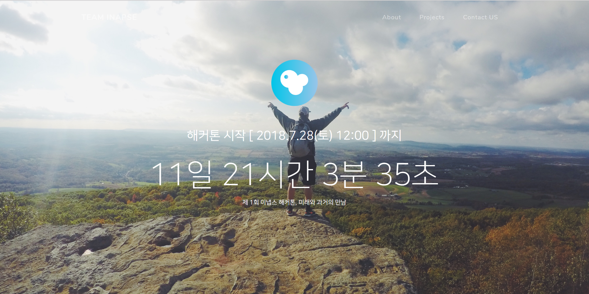

# Inapse Official Website
> We change everyday lives, We change the world

by Team Inapse

- 본 저장소는 Inapse의 공식 웹페이지 개발에 사용됩니다.
- 제 1회 Inapse 해커톤, `Rendezvous of the past and the future`에 대한 소개, 신청 및 해커톤에서 사용할 부가 기능(소스코드 제출 시스템, 타이머 등)까지 구현되어야 합니다.

## Develop Until...

- Inapse 인트로 웹페이지 개발 일정(2018.07.10 ~ 2018.07.17)
- Inapse 해커톤 웹페이지 개발 일정(미정)

## Todo : Inapse homepage

카카오톡과 Google 문서 상에서 이루어진 웹 개발팀 회의에서 결정된 계획과 구현 세부사항을 정리합니다(추가하고자 하는 사항이 있으면 주저 말고 수정해 주세요).

현재 개발 및 구현이 완료된 과정이나 지난 이벤트의 경우 아래 Task List에 체크 표시를 해주시면 감사하겠습니다.

- [ ] 오픈소스 웹사이트 템플릿 탐색하기
- [x] 백엔드 개발 기술 정하기(PHP, JavaScript 위주로 사용)
- [ ] Inapse 인트로 웹페이지 제작
    - [ ] 팀원 소개
    - [ ] 팀 연혁
    - [ ] 해커톤 개최 전까지 해커톤 홍보가 주가 되어야 하므로 메인페이지에 해커톤 배너나 디자인을 띄우는 등 강조가 필요
- [ ] Inapse 해커톤 웹페이지 제작
    - [ ] 해커톤 개최 전 사용
        - [ ] 해커톤 신청 안내 및 시스템
        - [ ] 해커톤 관련 질문(자주하는 질문 or 담당자 연락 시스템)
        - [x] 해커톤 개최까지 남은 시간 타이머
    - [ ] 해커톤 기간 중 사용
        - [ ] 해커톤 규칙 안내
        - [ ] 팀 / 팀원 등록 및 관리
        - [ ] 해커톤 종료까지 남은 시간 타이머
        - [ ] 파일 제출 시스템

## Screenshots

